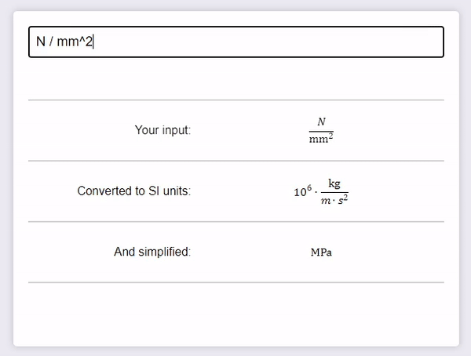

# [Dimensional Analysis Calculator](https://gre-v-el.github.io/Dimensional-Calculator/)

You can visit it [here](https://gre-v-el.github.io/Dimensional-Calculator/).

## Features

* Accepts all base and derived SI units.
* Accepts all SI prefixes.
* Accepts some "untypable" characters, like "ohm" → Ω and "micro" → µ
* Underlines errors.

## Description

This tool accepts a unit and expands it into its base SI units. It then simplifies it to the simplest form. It is very useful for checking the correctness of your calculations, especially in physics and engineering.

The website also features a short article and a little secret concerning esoteric measurement systems.